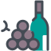

# El Bar de la FAI

## Instalación
* Ejecutar `$ npm install` para instalar las dependencias.
* Ejecutar `$ npm run dev` para iniciar el servidor en modo de prueba.
* Ejecutar `$ npm run start` para iniciar el servidor.
